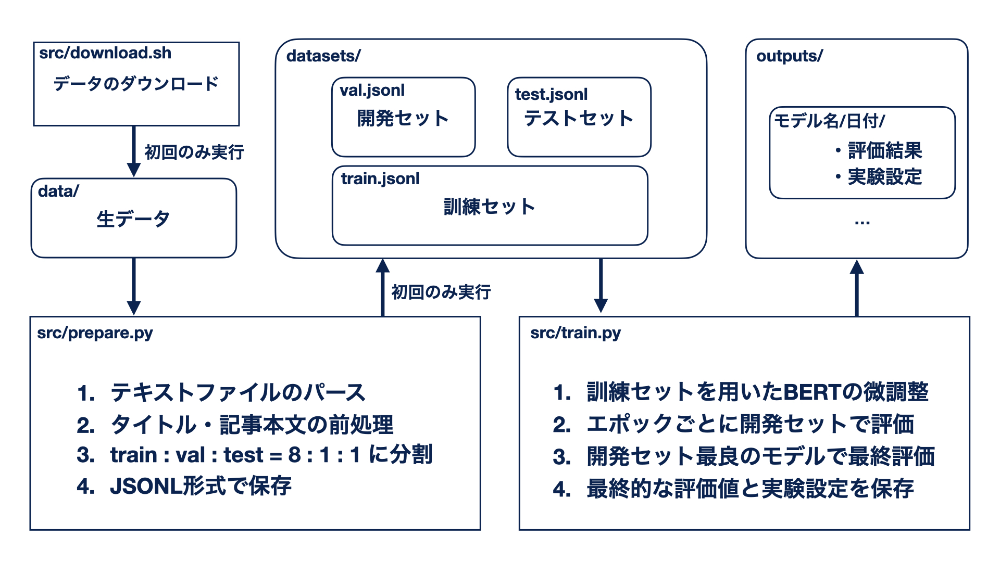

# BERT Classification Tutorial


## はじめに

Googleが2018年に発表した[BERT](https://arxiv.org/abs/1810.04805)は、その性能の高さや利便性から、今やあらゆる自然言語処理タスクで汎用的に用いられるようになっています。

BERTは**事前学習済み言語モデル (Pretrained Language Model)** と呼ばれるモデルの一種で、大量のテキストで事前にモデルの学習をおこなっておくことで、様々なタスクに利用できる言語知識を獲得しています。
この言語知識を転用することで、多様なタスクについて、今までよりも少ない学習データで非常に高い性能を発揮できることがわかっています。

BERTをテキスト分類などのタスクに適用する際は、BERTを微調整(fine-tuning)することでタスクを解きます。
例えば、ある映画のレビューが好意的(positive)か否定的(negative)かを分類するタスクを考えると、微調整の流れは以下のようになります。

1. レビューテキストを事前学習済みのBERTに入力する
2. BERTから得られる出力を用いてpositiveかnegativeかの分類を行う
3. 分類タスクにおける損失を計算し、損失をBERTに逆伝播させてBERTのパラメータを更新する

BERTは近年では[基盤モデル(Foundation Models)](https://arxiv.org/abs/2108.07258)とも呼ばれており、BERTの派生モデルも大量に登場しています。

さて、BERTが登場したのは2018年でした。
当時はRNNやLSTMと呼ばれるモデル構造が主流であり、[Transformer](https://arxiv.org/abs/1706.03762)と呼ばれるモデル構造をベースにしたBERTは、かなり目新しいものでした。
また、PyTorchなど深層学習用のライブラリもまだまだ発展途上であり、近年までBERTを取り巻く環境は混沌としていました。

しかし、2023年になって、BERTを利用するための環境が非常に整ってきました。
その代表例が[HuggingFace](https://huggingface.co)が公開している[Transformers](https://github.com/huggingface/transformers)というライブラリです。

Transformersを用いることで、BERTをはじめとする様々な事前学習済みモデルたちを簡単にダウンロード・利用できます。
Transformersは[PyTorch](https://pytorch.org/)や[Tensorflow](https://www.tensorflow.org/), [Jax](https://github.com/google/jax)/[Flax](https://github.com/google/flax)といった様々な深層学習用ライブラリと同時に利用できるので、環境を選ばずに事前学習済みモデルたちにアクセスすることができるようになりました。

Transformersの別の良さとしては、事前学習済みモデルのアップロードも簡単であるというのも特筆すべき点です。
これにより、研究や企業応用など、そのユースケースを問わず、様々なモデルをTransformersを通じて簡単にやりとりすることができるようになりました。
いまや誰でも簡単に、自作のBERTをHuggingFaceのサーバ上に公開し、広く一般に使用してもらうことができます。

さて、このようにBERTをはじめとして、事前学習済みモデルを取り巻く環境は極めて急速に整備がされてきました。
しかし、実際にBERTを用いてどのようにタスクを解けば良いか、というのは実はそこまで整備されていません(著者の感想)。

日々更新されていくライブラリ、特に最新のPython, PyTorch, Transformersなどに対応した、BERTを用いてタスクを解くための高品質なテンプレートはほとんど存在しません。

特に自然言語処理の初学者にとっては、「研究や実験をどのように開始したらよいかわからない」「よい設計、実験管理をどのように行えば良いかわからない」というのは非常に苦しいものです。

自然言語処理(に限りませんが)の研究や実験に取り組む際には、理解しやすく、自分が取り組むタスクに比較的近いテンプレート・参考実装が存在することのメリットは計り知れません。

そこで、BERTを用いたテキスト分類をテーマとしたモダンで高品質な深層学習用のテンプレート実装を目指して、本実装を公開します。
具体的には、本実装は「livedoorニュースコーパスをBERTを用いて分類する」流れを実装したものです。

本実装の主要な貢献は以下です。
1. Python 3.10, PyTorch 1.13, Transformers 4.25 以上に対応したモダンな記法・実装
2. Type Hintsを活用し、出来るだけ依存ライブラリとコード量を減らして、過度な抽象化を避けた見通しのよい設計
3. データ準備 → 訓練 & 評価 という実験プロセスの実装指針の提供
4. 一般的な評価値の算出を含む実験テンプレートとして、その他のタスクにも簡単に利用できる汎用的な実装

本実装の解説は[こちらの記事]でもしておりますので、ぜひ併せてご覧ください。
以降の節では、本実装を俯瞰しつつ、主要な項目について述べます。

## 実装の全体像

本実装は「livedoorニュースコーパスをBERTを用いて分類する」流れを実装したものです。

以下が、本実装の概要図です。




全体としては
1. 生データのダウンロード(初回のみ)
2. 生データを前処理してJSONL形式の実験用データセットを作成(初回のみ)
3. モデルの訓練と評価
という流れになっています。

データの前処理部分は事前に済ませるので、何度も重たい処理をする必要はありません。
また、データを事前に訓練・開発・テストセットに分割するので、様々なモデル・実験条件で比較評価を行いたい場合も、平等な評価(同じ訓練・評価データセットを用いた実験)が可能です。

さらに、本実装ではJupyter NotebookなどNotebook形式のファイルは一切利用していません。
これは経験上、Notebook形式のファイルのデバッグが極めて困難であり、バグの温床になることが多いと感じているためです。

したがって本実装は、ターミナル上でコマンドを実行していれば一連の流れが全て完了するように設計しています。
具体的には、各プログラムがコマンドライン引数を受け取るようになっており、プログラムの挙動を変更するために、プログラムを変更する必要はないように実装しています。

以降の節で詳しく説明しますが、本実装では以下のコマンドを実行すれば、環境構築・データセット作成・訓練&評価を行えるようになっています。

```bash
poetry config virtualenvs.prefer-active-python true
poetry install

bash src/download.sh
poetry run python src/prepare.py

poetry run python src/train.py
```

それでは、それぞれの要素について説明します。

## 環境構築, Installation

まず、環境構築について説明します。

本実装は**Python 3.10 以上** での実行を想定しています。
Python 3.10は、match文の導入やwith文の改善など様々な利便性の向上がなされている他、[Pythonが高速化の計画を進めていること](https://forest.watch.impress.co.jp/docs/news/1451751.html)もあり、早い段階で新しいPythonに適応しておくことのメリットは大きいと考えたためです。

また、Python 3.10では、Type Hints (型注釈)が以前のバージョンより自然に書けるようになっており、今までよりも堅牢かつ可読性の高いコードを書きやすくなっています。
そのため、公開実装のためのPythonとしても優れていると考えました。

Pythonの環境を構築する上で、おすすめの方法を2つ紹介するので、どちらか好きな方で環境構築をしてみてください。

### Install with poetry

1つめの環境構築法は、Pythonのパッケージマネージャである[Poetry](https://python-poetry.org/)を使ったものです。
Poetryを用いることで、インストールするPythonパッケージの依存関係やバージョンを比較的精密に管理することができます。

Poetryを利用する場合は別途[pyenv](https://github.com/pyenv/pyenv), [anyenv](https://github.com/anyenv/anyenv), [asdf](https://asdf-vm.com/)(おすすめ)といったPythonのバージョン管理ができるツールを用いて、Python 3.10をインストールしておく必要がある点に注意してください。

Poetryを利用した環境構築は、以下のようにすれば完了します。

```bash
poetry config virtualenvs.prefer-active-python true
poetry install
```

### Install with conda & pip

2つめの環境構築法は、[Miniconda](https://docs.conda.io/projects/continuumio-conda/en/latest/user-guide/install/index.html)を使ったものです。
Minicondaは、科学計算用ライブラリを簡単にインストールできるパッケージマネージャであるAnacondaの縮小版です。

Minicondaを用いる環境構築では、通常さまざまなパッケージを`conda`コマンドでインストールします。
しかし、`conda`コマンドでインストールできるパッケージはしばしば古く、管理が難しいことがあります。

したがって今回は、Minicondaを用いてPython 3.10の仮想環境を構築し、その仮想環境の中にpip (Pythonのデフォルトのパッケージ管理ツール)でライブラリをインストールします。

ここで、PyTorchは通常通り`conda`コマンドでインストールします。
これは、PyTorchのインストールには非常に多くの複雑怪奇な依存関係が存在する(例えば、システムのGCCのバージョンなど)ため、これらに関連して発生する問題をできるだけ避けるためです。

環境構築は以下のようにコマンドを実行すれば完了すると思います。

```bash
conda create -n bert-classification-tutorial python=3.10

// see: https://pytorch.org/get-started/locally/
conda install pytorch pytorch-cuda=11.6 -c pytorch -c nvidia

pip install tqdm "transformers[ja,sentencepiece]" classopt tokenizers numpy pandas more-itertools scikit-learn scipy
```

### 補足

以降はPoetryを用いて環境構築をした場合のコマンドを紹介しますが、minicondaを用いて環境構築をした場合は、`poetry run python`と書いてある部分を`python`に読み替えてください。

環境変数として以下の値を設定しておくと、warningsやメッセージが煩わしくなくて便利です(警告メッセージを消す設定が含まれるので、自己責任でお願いします)。

```sh:.envrc
export TF_CPP_MIN_LOG_LEVEL="2"
export TOKENIZERS_PARALLELISM="false"
export TRANSFORMERS_VERBOSITY="error"
export DATASETS_VERBOSITY="error"
export PYTHONPATH="$PWD:$PYTHONPATH"
```

特に、`PYTHONPATH`の設定は、`conda`で仮想環境を作成した場合は必要になります。
Pythonにおける自作モジュールのimportのため、[direnv](https://github.com/direnv/direnv)などのツールを用いて`.envrc`に記述されている環境変数の設定、または上述の`PYTHONPATH`設定をお願いします。


## データセット作成

次に、データセットの作成と前処理について説明します。

本実装では、分類対象のテキストとしてRONDHUIT社が公開する[livedoorニュースコーパス](http://www.rondhuit.com/download.html#ldcc)を用います。

livedoorニュースコーパスは、9つのカテゴリのニュース記事が集約されたデータセットです。
通常、ニュース記事のタイトルと本文を用いて、そのニュース記事がどのカテゴリにあてはまるかを分類する9値分類を行います。

実際のデータの一部を、以下の示します。

```txt:movie-enter-5844065.txt
http://news.livedoor.com/article/detail/5844065/
2011-09-07T19:35:00+0900
ハリウッド最強のタッグが贈る感動巨編『リアル・スティール』、数量限定BE@RBRICKストラップ付き鑑賞券を発売
　スティーブン・スピルバーグ率いるドリームワークスが、魂を揺さぶる感動と、エキサイティングなアクションを兼ね備えた、渾身のエンターテイメントを世に放つ。
...
```

本実装では、以下のコマンドを実行すればデータセットのダウンロードと前処理が完了するようになっています。

```bash
bash src/download.sh

poetry run python src/prepare.py
```

流れとしては、まず`src/download.sh`がデータセットのダウンロードと生データの展開を行います。

次に、`src/prepare.py`を実行することで、生データをJSONL形式(1行ごとにJSON形式のデータが書き込まれている形式)に変換します。
その際、NFKC正規化などの前処理も実行します。

JSONL形式は近年よく利用されるようになってきたデータ形式であり、素直にPythonで読み込むことが可能である点、csv/tsvと比較して配列や階層のあるオブジェクトの表現が自然な点などから、機械学習用途で用いるには極めて扱いやすいデータ形式です。
本実装もJSONL形式でデータをやりとりするようになっています。

上記の前処理に加えて、分類モデルの訓練のため、分類先となるカテゴリを文字列から数値に変換し、その変換表も保存します。
変換表は以下のようになります。
ラベルの変換表を保存しておくと何かと便利です。

```json:label2id.json
{
  "dokujo-tsushin": 0,
  "it-life-hack": 1,
  "kaden-channel": 2,
  "livedoor-homme": 3,
  "movie-enter": 4,
  "peachy": 5,
  "smax": 6,
  "sports-watch": 7,
  "topic-news": 8
}
```

また、全データを訓練(train):開発(val):テスト(test)=8:1:1の割合に分割します。
これにより、訓練中に開発セットを用いて、モデルが過学習していないかの確認が行えるようになります。
テストセットは最終的な評価にのみ用います。

保存されたデータセットは以下のような形式になっています。
```
datasets/livedoor
├── label2id.json
├── all.jsonl (7367行)
├── test.jsonl (736行)
├── val.jsonl (736行)
└── train.jsonl (5895行)
```


## 訓練 & 評価

次に、BERTの微調整(訓練)について説明します。

といっても、本実装では、1つのコマンドで訓練から評価までを一貫して行えるようにしてあるので非常に簡単です。

以下のコマンドを実行することで、`cl-tohoku/bert-base-japanese-v2`を用いたテキスト分類モデルの訓練が実行できます。

```bash
poetry run python src/train.py --model_name cl-tohoku/bert-base-japanese-v2
```

この時、`--model_name`に与える引数を例えば`bert-base-multilingual-cased`にすることで、多言語BERTを用いた学習が実行できます。

また、ほとんどの設定をコマンドライン引数として与えら得れるようにしているので、以下のように複数の設定を変更して実行することも可能です。

```bash
poetry run python src/train.py \
  --model_name studio-ousia/luke-japanese-base-lite \
  --batch_size 32 \
  --epochs 10 \
  --lr 5e-5 \
  --num_warmup_epochs 1
```

特筆すべき点としては、本実装では学習後のモデルは保存せず、訓練のたびに評価値を算出し、評価値のみを保存するようにしていることが挙げられます。

「学習済みモデルを保存」→「保存済みモデルを読み込んで評価」、という流れの実装はよくありますが、この実装は実験の途中でどのモデルを使用していたのか忘れてしまったり、モデルの構造が学習時と変わってしまっていたり、評価用データを間違えてしまったり、といった問題が発生しやすいと考えています。

そこで本実装では、訓練のたびに必要な評価を行ってその結果のみを保存しておき、モデルは保存しない方針を採用しました。
これにより、モデルの構造を変化させたり、学習・評価データを変化させた場合でも、訓練をし直すだけで常に間違いのない結果を得られます。

研究における実験プロセスの中では、間違いのない実験結果を積み重ねていくことが、研究を進めていく上で最も重要だと考えているので、間違いが発生しづらいこの方針はスジがよいと考えています。

本実装において、実験結果は `outputs/[モデル名]/[年月日]/[時分秒]`のディレクトリに保存されます。
実際には、以下のようなディレクトリ構造で結果が保存されます。

```
outputs/bert-base-multilingual-cased
└── 2023-01-13
    └── 05-38-02
        ├── config.json
        ├── log.csv
        ├── test-metrics.json
        └── val-metrics.json
```

`config.json`が実験時の設定で、このファイルに記述してある値を用いることで、同じ実験を再現することができるようにしてあります。
また、`log.csv`に学習過程における開発セットでのepochごとの評価値を記録してあります。

そして、`val-metrics.json`と`test-metrics.json`に、開発セットの評価値が最もよかった時点でのモデルを用いた、開発セットとテストセットに対する評価値を記録してあります。

実際の`test-metrics.json`は以下のようになっています。

```json:test-metrics.json
{
  "loss": 2.845567681340744,
  "accuracy": 0.9619565217391305,
  "precision": 0.9561782755165722,
  "recall": 0.9562792450871114,
  "f1": 0.9559338777925345
}
```


### その他

`src/utils.py`に、`list[dict]`なデータをJSONL形式で保存・読み込む関数や、`list[dict]`の平均を取る関数、乱数シード値の設定を行う関数など、さまざまな便利関数を定義してあります。
ぜひご利用ください。

また、`src/aggregate.py`を実行することで、`outputs`ディレクトリ以下の結果を単一のcsvファイルにまとめることができます。このスクリプトは適宜改造してお使いください。


## 評価実験

最後に、本実装によって、livedoorニュースコーパスの9値分類を行う評価実験を実施したので、その実験について述べます。

一連の実験は、`run.sh`に記述してあるコマンドを実行すれば再現することが可能です。
ハイパーパラメータはすべて本実装のデフォルト値です。

実験結果に対する注意ですが、実験は単一の乱数シード値で1度しか実施しておらず、分割交差検証も行っていないので、実験結果の正確性は高くありません。
したがって、以下の結果は過度に信用せず、参考程度に見てもらうよう、お願いいたします。

では、結果の表を以下に示します。
baseサイズのモデルとlargeサイズのモデルの2種類にモデルを大別して結果をまとめました。
なお、Accuracy (正解率)以外の値、つまりPresicion (精度)、Recall (再現率)、F1はmacro平均を取った値です。
また、すべての値は%表記です。

| base models                                                                                                               | Accuracy  | Precision |  Recall   |    F1     |
| ------------------------------------------------------------------------------------------------------------------------- | :-------: | :-------: | :-------: | :-------: |
| [cl-tohoku/bert-base-japanese-v2](https://huggingface.co/cl-tohoku/bert-base-japanese-v2)                                 | **97.15** | **96.82** | **96.55** | **96.64** |
| [cl-tohoku/bert-base-japanese-char-v2](https://huggingface.co/cl-tohoku/bert-base-japanese-char-v2)                       |   96.20   |   95.54   |   95.21   |   95.34   |
| [cl-tohoku/bert-base-japanese](https://huggingface.co/cl-tohoku/bert-base-japanese)                                       |   96.47   |   96.15   |   95.67   |   95.83   |
| [cl-tohoku/bert-base-japanese-whole-word-masking](https://huggingface.co/cl-tohoku/bert-base-japanese-whole-word-masking) |   96.74   |   96.43   |   95.97   |   96.13   |
| [cl-tohoku/bert-base-japanese-char](https://huggingface.co/cl-tohoku/bert-base-japanese-char)                             |   95.65   |   94.98   |   94.88   |   94.89   |
|                                                                                                                           |           |           |           |           |
| [studio-ousia/luke-japanese-base-lite](https://huggingface.co/studio-ousia/luke-japanese-base-lite)                       |   96.88   |   96.53   |   96.47   |   96.48   |
|                                                                                                                           |           |           |           |           |
| [bert-base-multilingual-cased](https://huggingface.co/bert-base-multilingual-cased)                                       |   96.20   |   95.62   |   95.63   |   95.59   |
| [xlm-roberta-base](https://huggingface.co/xlm-roberta-base)                                                               |   96.20   |   95.65   |   95.60   |   95.61   |
| [studio-ousia/mluke-base-lite](https://huggingface.co/studio-ousia/mluke-base-lite)                                       |   96.47   |   95.82   |   95.94   |   95.86   |

まず、baseサイズのモデルの結果について観察すると、今回の実験では東北大BERTのバージョン2 (bert-base-japanese-v2)が最も高い性能になったことがわかります。
Accuracyが97.15、F1が96.64と、かなり高い割合で正しく分類することができていると思います。
東北大が公開しているモデルのbert-base-japanese-whole-word-maskingと比較して、bert-base-japanese-v2の方が性能が高く、東北大BERTの中だと、今後は最初にbert-base-japanese-v2を使って問題なさそうだという印象です。

次点はStudio Ousiaの日本語LUKEで、こちらも非常に高い割合で正しく分類を行えていると思います。

文字ベースのモデル(cl-tohoku/bert-base-japanese-char-v2など)は、他のモデルと比較して若干性能が低いですが、十分高い性能であるといえると思います。

多言語モデルの中では、Studio OusiaのmLUKEが最も高い性能になりました。


| large models                                                                                          | Accuracy  | Precision |  Recall   |    F1     |
| ----------------------------------------------------------------------------------------------------- | :-------: | :-------: | :-------: | :-------: |
| [cl-tohoku/bert-large-japanese](https://huggingface.co/cl-tohoku/bert-large-japanese)                 | **97.69** | **97.50** |   96.84   | **97.10** |
| [studio-ousia/luke-japanese-large-lite](https://huggingface.co/studio-ousia/luke-japanese-large-lite) |   97.55   |   97.38   |   96.85   |   97.06   |
|                                                                                                       |           |           |           |           |
| [xlm-roberta-large](https://huggingface.co/xlm-roberta-large)                                         |   97.15   |   96.73   |   96.71   |   96.70   |
| [studio-ousia/mluke-large-lite](https://huggingface.co/studio-ousia/mluke-large-lite)                 |   97.42   |   97.25   | **96.97** |   97.08   |

次に、largeサイズのモデルの結果について観察すると、AccuracyとF1では東北大BERT (large)が最も高い性能になりましたが、Studio Ousiaの日本語LUKEや多言語LUKEと比較して、ほとんど同じ性能になりました。
全体として、baseサイズのモデルよりも高い性能となっており、モデルサイズを増大させることによる性能向上が観察できました。

以上の実験の結果は、すべて同一のハイパーパラメータで学習を実行した結果です。
適切にハイパーパラメータ探索を行うことで、それぞれのモデルの性能はさらに向上する可能性があり、それにともなって性能の順位も変動する可能性が高いです。


## おわりに

BERTを用いたテキスト分類をテーマとしたモダンで高品質な深層学習用のテンプレート実装を目指し、本実装を公開しました。

本実装が研究・企業応用・個人利用問わずさまざまな方のお役に立てれば幸いです。

質問・バグ報告などがあればどんなことでも[Issue](https://github.com/hppRC/bert-classification-tutorial/issues)にお書きください。


## 参考文献

- [【実装解説】日本語版BERTでlivedoorニュース分類：Google Colaboratoryで（PyTorch）](https://qiita.com/sugulu_Ogawa_ISID/items/697bd03499c1de9cf082)
- [Livedoorニュースコーパスを文書分類にすぐ使えるように整形する](https://radiology-nlp.hatenablog.com/entry/2019/11/25/124219)
- [BERTによる日本語構文解析の精度向上](https://www.anlp.jp/proceedings/annual_meeting/2019/pdf_dir/F2-4.pdf)
- [研究のためのPython開発環境](https://zenn.dev/zenizeni/books/a64578f98450c2)
- https://github.com/yoheikikuta/bert-japanese/blob/master/notebook/finetune-to-livedoor-corpus.ipynb
- https://github.com/sonoisa/t5-japanese/blob/main/t5_japanese_classification.ipynb
- https://gist.github.com/kanjirz50/1ef6813df7faed3838629a3eea73774b
- https://www.pytry3g.com/entry/2018/04/03/194202
- https://www.nlp.ecei.tohoku.ac.jp/news-release/3284/
- https://github.com/cl-tohoku/bert-japanese/tree/v2.0

## 著者情報・引用

作者: [Hayato Tsukagoshi](https://hpprc.dev) \
email: [research.tsukagoshi.hayato@gmail.com](mailto:research.tsukagoshi.hayato@gmail.com)

論文等で本実装を参照する場合は、以下をお使いください。

```bibtex
@misc{
  hayato-tsukagoshi-2023-bert-classification-tutorial,
  title = {{BERT Classification Tutorial}},
  author = {Hayato Tsukagoshi},
  year = {2023},
  publisher = {GitHub},
  journal = {GitHub repository},
  howpublished = {\url{https://github.com/hppRC/bert-classification-tutorial}},
  url = {https://github.com/hppRC/bert-classification-tutorial},
}
```